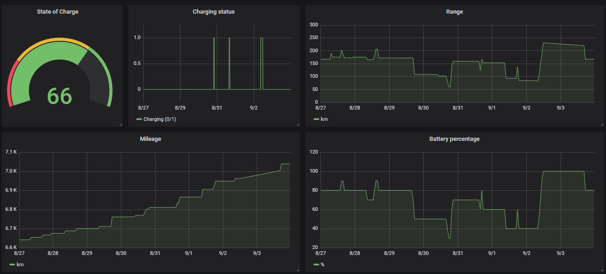

# Volkswagen-Tracker
[](https://www.gnu.org/licenses/gpl-3.0)
[](https://www.codacy.com/manual/fritzjo-git/volkswagen-tracker?utm_source=github.com&amp;utm_medium=referral&amp;utm_content=FritzJo/volkswagen-tracker&amp;utm_campaign=Badge_Grade)

Volkswagen-Tracker is a Python script to gather information about your Volkswagen.
I initially created this tool to measure the mileage of my car in a Grafana dashboard, but decided
to expand the project to cover other data as well.

It uses the unofficial API of the [Volkswagen We-Connect](https://www.portal.volkswagen-we.com/portal/) (new Car-Net) Website, which means this application only works with We-Connect-enabled vehicles.
All the data collected is stored in a database.

The API interaction itself is mainly based on the work of [reneboer](https://github.com/reneboer/python-carnet-client).

## Features
* Collecting:
  * Mileage
  * Range
  * Charging status
  * Battery percentage
* Writing the gathered data to a database
* Supported database types
  * InfluxDB
  * SQLite
  * Local / CSV
* Docker integration

## Roadmap
* Collect more information from We-Connect
* Guides for Grafana intergration

## How-To
### Docker
```bash
git clone https://github.com/FritzJo/volkswagen-tracker.git
cd volkswagen-tracker
docker build -t volkswagen-tracker .
docker run -e VW_USERNAME= \
           -e VW_PASSWORD= \
           -e VW_DATABASE_HOST= \
           -e VW_DATABASE_PORT= \
           -e VW_DATABASE_USER=\
           -e VW_DATABASE_PASS= \
           -e VW_UPDATE_INTERVAL= \
           volkswagen-tracker
```
Alternatively use the docker-compose file that is provided with this repository.
Simply edit the yml file, fill in your credentials and run the following command to
start the application with a InfluxDB. The database will be exposed to port 8086
by default. 

If you look for a complete solution (including Grafana), you can use
the [docker-compose.yml.grafana](https://github.com/FritzJo/volkswagen-tracker/blob/master/docker-compose.yml.granfana) file to deploy everything at once.
```bash
docker-compose up -d --build
```
### Parameters
|Parameter|Description|
|---|---|
|VW_USERNAME|Your We-Connect Email.|
|VW_PASSWORD|Your We-Connect Password.|
|VW_DATABASE_TYPE|Select the database backend (influx, sqlite or local)
|VW_DATABASE_HOST|The database host address. If you use Docker, this is the name of the database container.|
|VW_DATABASE_PORT|Database port (default is 8086 for InfluxDB).|
|VW_DATABASE_USER|Database user.|
|VW_DATABASE_PASS|The password for the database user.|
|VW_UPDATE_INTERVAL|Wait time between updates (hours).|
